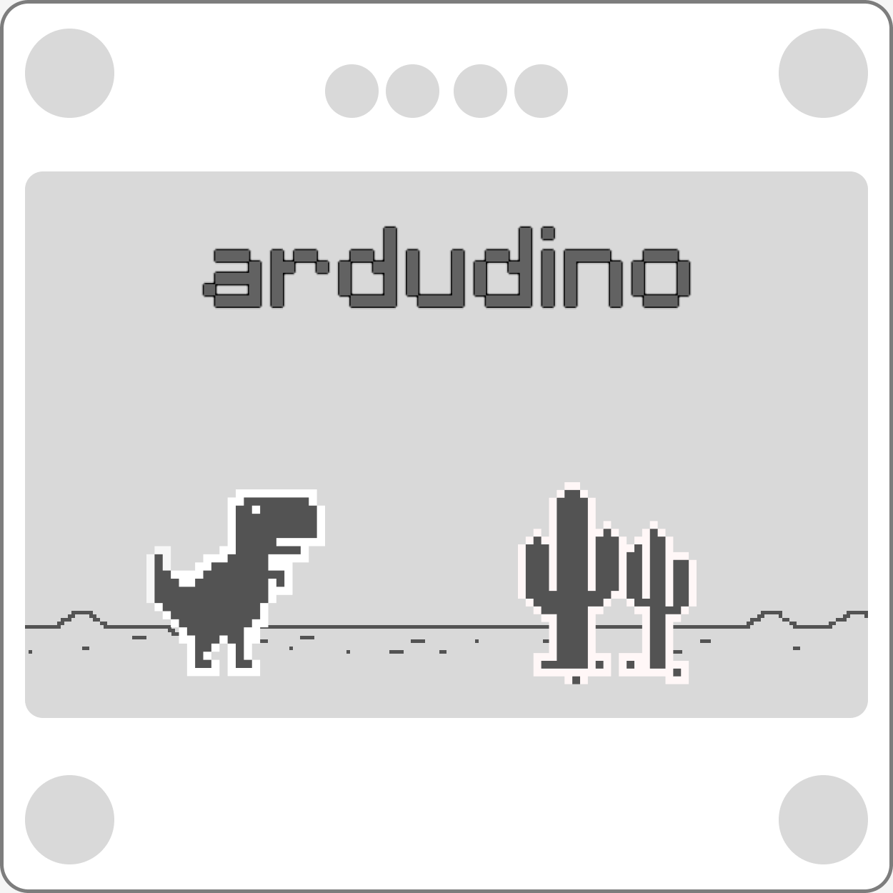
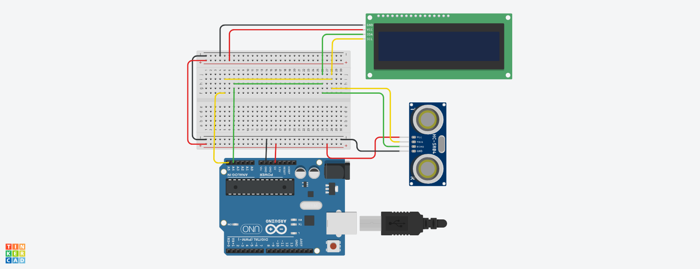

  
  

## Conteúdo
- [Conteúdo](#conteúdo)
- [Resumo](#resumo)
- [Descrição](#descrição)
- [Como compilar](#como-compilar)
- [Detalhes](#detalhes)
- [Componentes](#componentes)
- [Circuito](#circuito)
- [Autores](#autores)

## Resumo

O projeto consiste em um **mini emulador** de jogo controlado por um Arduino. O Arduino irá controlar uma tela Oled i2c no qual conterá um jogo baseado no Dino do navegador Chrome (T-Rex Running).

## Descrição

valor

## Como compilar

valor

## Detalhes

valor

## Componentes

- Display i2c (Tela Oled 1.3’’ 128x64)
- Arduino Uno
- Push button
- Leds
- Resistores
- Acelerômetro (MPU)

## Circuito

  

## Autores

- **[@luizfelmach](https://github.com/luizfelmach)**
- **[@gabriellybc](https://github.com/gabriellybc)**
- **[@carpesfelipe](https://github.com/carpesfelipe)**
